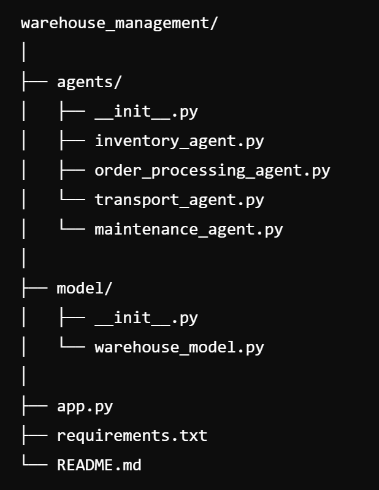

# AgentWare Nexus - Warehouse Management Multiagent System

This project implements a warehouse management system using a multiagent approach with the Mesa framework. The system simulates the interactions between different agents responsible for inventory management, order processing, and maintenance.

## Project Structure



### - **agents**
This directory contains the agent classes responsible for different tasks within the warehouse:
- **InventoryAgent**: Manages inventory levels and updates.
- **OrderProcessingAgent**: Processes customer orders by checking inventory and coordinating with the transport agent.
- **TransportAgent**: Simulates the transportation of items to the dispatch area.
- **MaintenanceAgent**: Monitors the warehouse environment and ensures operational stability.

### - **model**
Contains the model class that orchestrates the interactions between agents:
- **WarehouseModel**: A Mesa model that instances of all agents and manages the overall simulation.

### - **app.py**
The Streamlit interface to interact with the multiagent system. This file allows users to process orders, monitor the environment, and check inventory status.

### - **requirements.txt**
Lists all the Python dependencies required to run the project.

## Installation

1. Clone the repository:
```bash
git clone https://github.com/abhinavbammidi1401/AgentWare_Nexus
cd AgentWare_Nexus
```

2. Install the required Python packages:
```bash
pip install -r requirements.txt
```

3. Run the app:
```bash
streamlit run app1.py
```

## Dependencies

- *streamlit*
- *mesa*